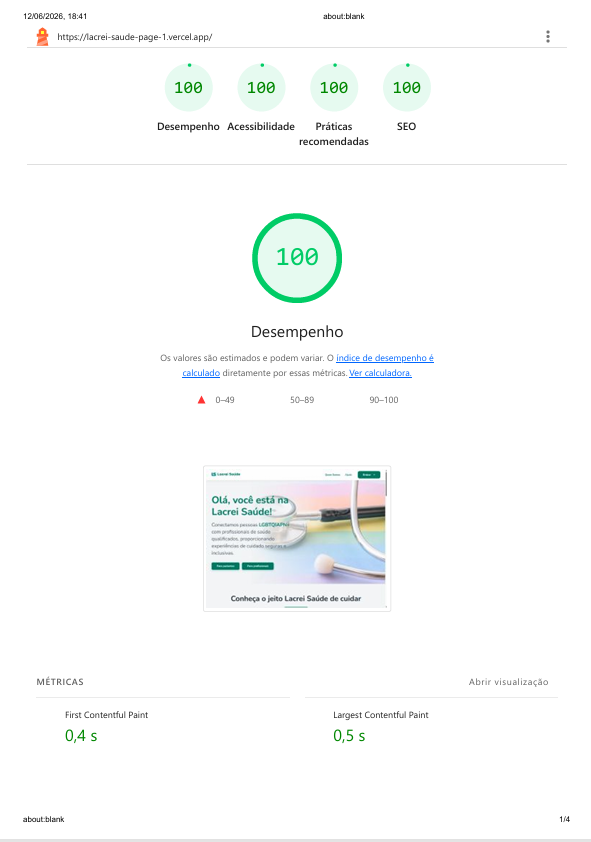
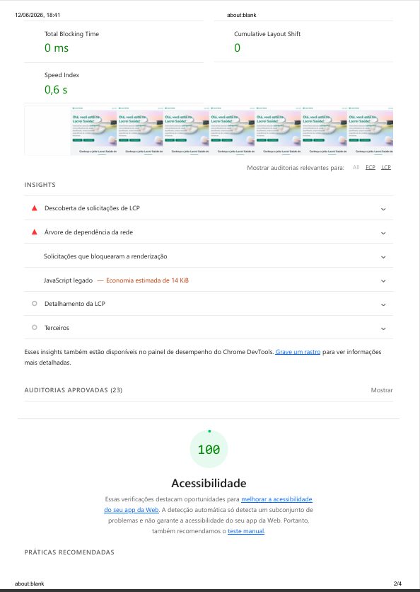
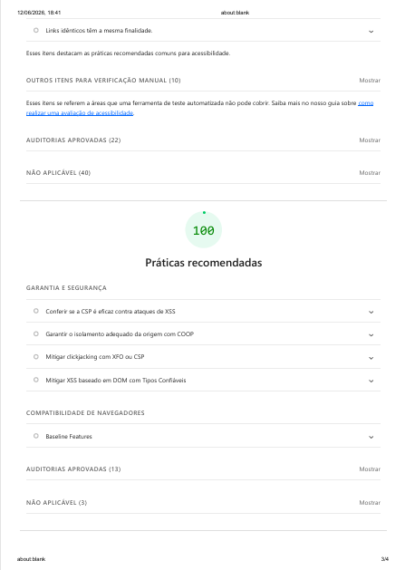
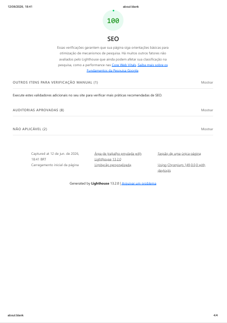

# Lacrei Saude - Desafio Front-end

Aplicacao desenvolvida como parte do desafio tecnico para voluntariado na **Lacrei Saude**. O projeto foi construido com foco em **acessibilidade**, **responsividade**, **performance** e **boas praticas de desenvolvimento**, utilizando tecnologias modernas do ecossistema React.

---

## Sumario

1. [Visao Geral](#visao-geral)
2. [Tecnologias Utilizadas](#tecnologias-utilizadas)
3. [Estrutura de Pastas](#estrutura-de-pastas)
4. [Instalacao e Execucao](#instalacao-e-execucao)
5. [Funcionalidades e Jornadas](#funcionalidades-e-jornadas)
6. [Identidade Visual](#identidade-visual)
7. [Arquitetura e Decisoes Tecnicas](#arquitetura-e-decisoes-tecnicas)
8. [Acessibilidade e Inclusao](#acessibilidade-e-inclusao)
9. [Performance e Otimizacao](#performance-e-otimizacao)
10. [Testes e Qualidade](#testes-e-qualidade)
11. [Deploy e Manutencao](#deploy-e-manutencao)
12. [Contribuicao](#contribuicao)

---

## Visao Geral

A **Lacrei Saude** conecta pessoas da comunidade LGBTQIAPN+ com profissionais de saude comprometidos em oferecer um atendimento seguro, inclusivo e respeitoso. Este projeto representa a interface front-end focada na jornada de onboarding e informacional da plataforma.

- **Deploy**: [https://lacrei-saude-page-1.vercel.app/](https://lacrei-saude-page-1.vercel.app/)
- **Repositorio**: [https://github.com/PauloHenrique993940/lacrei-saude-page-1](https://github.com/PauloHenrique993940/lacrei-saude-page-1)
- **Documentacao complementar**:
   - `ACCESSIBILITY.md` com criterios, auditorias e evidencias de acessibilidade.
   - `PERFORMANCE.md` com resultados, estrategia e artefatos de Lighthouse.
   - `MARSHA_ADHERENCE.md` com o racional de aderencia ao guia visual Marsha.

---

## Tecnologias Utilizadas

- **Core**: Next.js 15+ (App Router), React 19, TypeScript.
- **Estilizacao**: Styled-Components (CSS-in-JS).
- **Qualidade**: Jest, React Testing Library.
- **Otimizacao**: Google Lighthouse, Next/Font, Next/Image.
- **Deploy**: Vercel.

---

## Estrutura de Pastas

```text
src/
|-- app/               # Rotas e paginas (Next.js App Router)
|   |-- cadastro/      # Fluxo de onboarding (7 etapas)
|   |-- printDoc/      # Evidencias visuais e PDFs dos testes realizados
|   |-- components/    # Componentes globais (Header, Footer, Button)
|   |-- services/      # Integracoes e Mock API
|   |-- styles/        # Tema e Estilos Globais
|   `-- (outras paginas institucionais)
```

---

## Instalacao e Execucao

### Pre-requisitos

- Node.js (v18+)
- NPM ou Yarn

### Passos

1. **Clone o repositorio**:

   ```bash
   git clone https://github.com/PauloHenrique993940/lacrei-saude-page-1.git
   cd lacrei-saude-page-1
   ```

2. **Instale as dependencias**:

   ```bash
   npm install
   ```

3. **Execute em modo desenvolvimento**:

   ```bash
   npm run dev
   ```

   Acesse [http://localhost:3000](http://localhost:3000).

---

## Funcionalidades e Jornadas

### 1. Jornada Institucional

- **Home (`/`)**: Apresentacao da proposta Lacrei Saude.
- **Quem Somos (`/quem-somos`)**: Missao, visao e valores.
- **Seguranca (`/seguranca`)**: Politicas de privacidade e protecao de dados (LGPD).
- **Acessibilidade (`/acessibilidade`)**: Recursos de inclusao digital.

### 2. Fluxo de Onboarding (PO)

Fluxo gamificado e semantico composto por 7 etapas:

1. `onboarding`: Boas-vindas.
2. `pronome`: Identificacao de tratamento.
3. `genero`: Identidade de genero.
4. `sexualidade`: Orientacao sexual.
5. `etnia`: Identificacao etnico-racial.
6. `deficiencia`: Identificacao PCD.
7. `concluido`: Sucesso com integracao Mock API.

---

## Identidade Visual

O projeto utiliza o **Guia de Estilo Marsha P. Johnson** como referencia visual para tokens e diretrizes de interface. A entrega prioriza **aderencia de linguagem visual e experiencia** em vez de uma reproducao 1:1 de um catalogo oficial de componentes.

Principais pontos de aderencia:

- **Cor Primaria**: Verde Lacrei (`#018762`) para acoes e acessibilidade.
- **Gradiente Rainbow**: Implementado em bordas e divisores para reforcar a identidade LGBTQ+.
- **Tipografia**: Nunito (peso 700) para maxima legibilidade.
- **Tokens centralizados**: Cores, espacamentos, raios e estados ficam concentrados em `src/styles/theme.ts`.
- **Documentacao detalhada**: O mapeamento entre guia visual e implementacao esta em `MARSHA_ADHERENCE.md`.

---

## Arquitetura e Decisoes Tecnicas

- **Componentizacao**: Reuso estrito de componentes como `Button`, `RadioGroup` e `Stepper`.
- **Atomic Design**: Organizacao baseada em complexidade crescente.
- **Mock API**: Simulacao de latencia e persistencia em `src/services/api.ts` para demonstrar resiliencia da UI.
- **Styled Props**: Uso de prefixo `$` (transient props) para evitar vazamento de estilos para o DOM.

---

## Acessibilidade e Inclusao

Score Lighthouse documentado: 100/100

- **Semantica HTML5**: Uso rigoroso de tags como `<main>`, `<nav>` e `<footer>`.
- **WAI-ARIA**: Atributos `aria-label`, `aria-live` e `roles` em componentes interativos e no stepper de cadastro.
- **Contraste**: Validado conforme WCAG 2.1 AA/AAA.
- **Navegacao**: Fluxos principais preparados para navegacao via teclado, foco visivel e feedback assistivo.

Documentacao complementar:

- `ACCESSIBILITY.md` detalha criterios auditados, matriz de validacao e artefatos.
- `src/app/printDoc/` concentra as capturas e PDFs utilizados como evidencia.

---

## Performance e Otimizacao

Score Lighthouse documentado: 88

- **Imagens**: Uso de `next/image` com formatos AVIF/WebP e `sizes` responsivos.
- **Fonts**: Carregamento otimizado via `next/font/google` para evitar CLS.
- **Bundle**: Code-splitting automatico por rota.
- **Deploy em producao**: Auditorias documentadas sobre a versao hospedada na Vercel.

### Evidencias de teste

Os arquivos de apoio dos testes de desempenho e validacoes visuais estao disponiveis em `src/app/printDoc/`:

- PDFs:
- [doload.pdf](src/app/printDoc/doload.pdf)
- [download-1.pdf](src/app/printDoc/download-1.pdf)

- Capturas de tela:









---

## Testes e Qualidade

Execucao de testes unitarios em componentes criticos:

```bash
npm test
```

- **Jest**: Runner de testes.
- **React Testing Library**: Foco em testes voltados ao comportamento do usuario.

---

## Deploy e Manutencao

- **Plataforma**: Vercel para deploys continuos e imutaveis.
- **URL funcional**: [https://lacrei-saude-page-1.vercel.app/](https://lacrei-saude-page-1.vercel.app/)
- **Rollback**: Capacidade de reversao instantanea via dashboard Vercel ou comando git:

  ```bash
  git revert HEAD
  git push origin main
  ```

---

## Contribuicao

Para garantir a qualidade, siga o checklist:

1. Validar contraste de cores (minimo 4.5:1).
2. Garantir navegacao via teclado.
3. Seguir padrao de nomenclatura (PascalCase para componentes).
4. Rodar `npm test` antes de cada submissao.

---

Desenvolvido com carinho para a **Lacrei Saude**.
